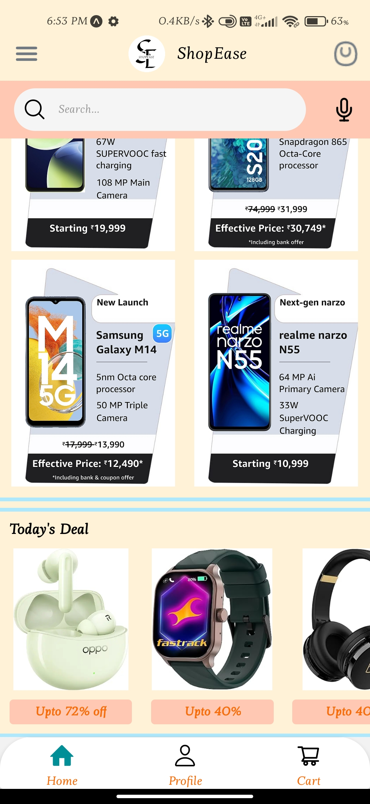

## ShopEase Ecommerce Mobile App
 

#### Features & Components

- WelcomeScreen (starting)
- Login / Register
- HomeScreen (List of products, image slider, image carousel)
- Detail products
- Product category
- CartScreen
- ProfileScreen
- Resuable Button component
- Custom Alert
- Custom Input

## ScreenShot

#### Assignment-1
###### Welcome Page

#### Assignment-2
###### Registration Page

###### Login Page

###### Form Validation Added (Custom Alert Message)

  
  

#### Assignment-3
###### Reusable Button Components Display Page

#### Assignment: 4-10
##### Products Page (HomeScreen: Category & Carousel)

  
  

  
  

###### Product Detail

###### Cart Detail

